# AWS-Skill-Builder

# -AWS Cloud Practitioner Essentials-

## Module 1: Introduction to AWS

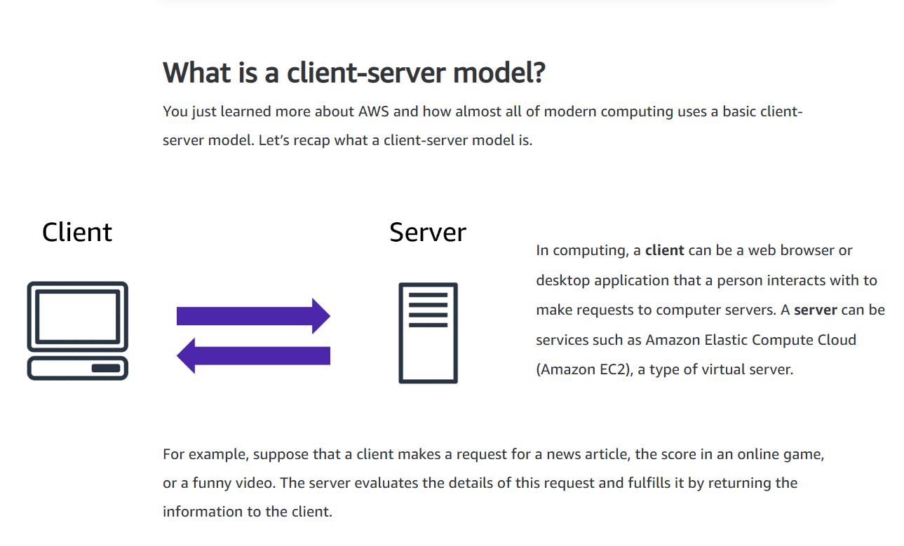

### ***AWS Cloud Computing***
#### ***The on-demand delivery of IT resources over the internet with pay-as-you-go pricing***

- **On-demand Delivery** = Use what you need, when you need it. No need to specify or plan it via console in advance, just get it and use it.

- **IT Resources** = Computing resources to fit every need. Why does AWS have so many different products available? Because people need it, as industries are so diverse, so are the technological needs that they each have. So AWS aims at having products available that can fit every need.

- ***Undiferentiated heavy lifting of IT*** = Task that are common, often repetitive, and mainly time consuming. These are the tasks that AWS handles for you, so you can worry only about doing what you are meant to.

- **Over the internet** = It implies that you can access and use the resources using a secure web page console, or programataically. No need for contracts or sales calls.

- **Pay-as-you-go Pricing** = Why pay for resources when you don t need them? You pay for what you use, for as long as you use them. No extra charges, no up front payment. 

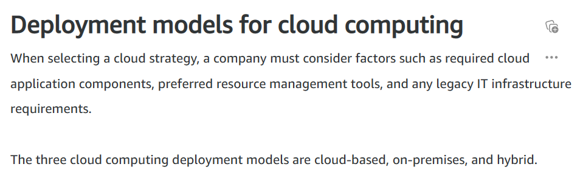

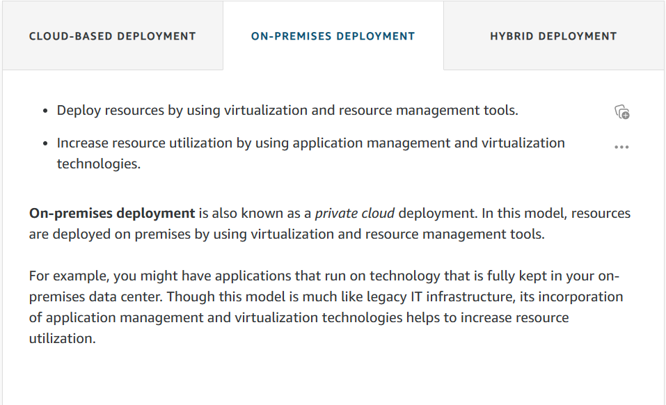

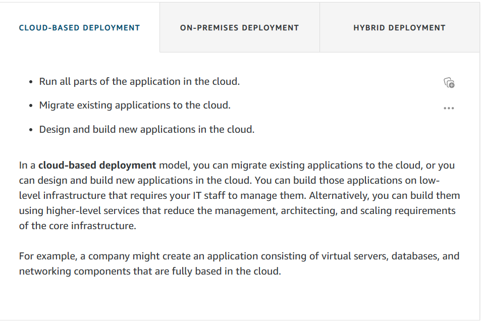

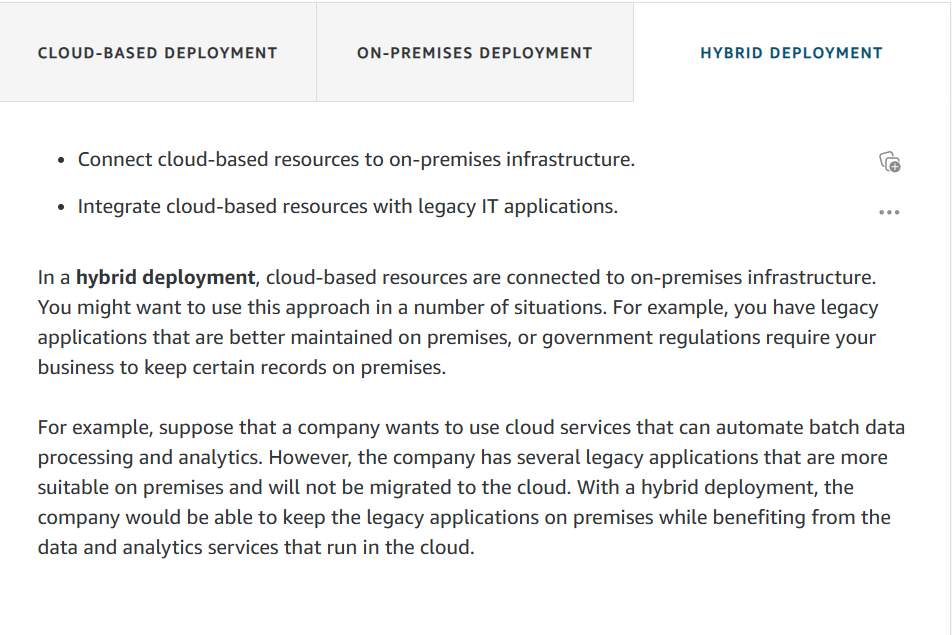

### ***Benefits of Cloud Computing***

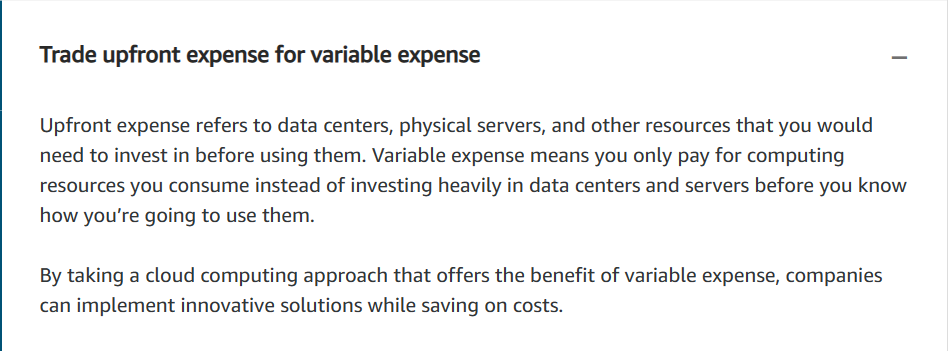

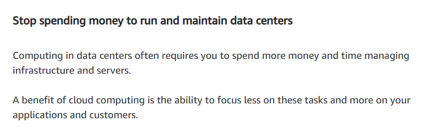

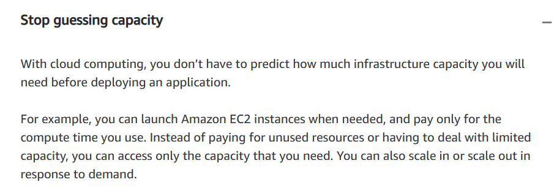

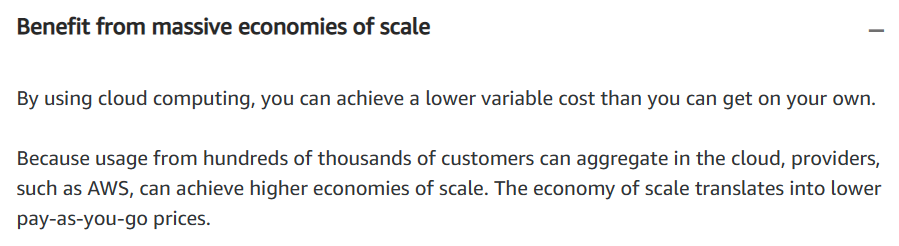

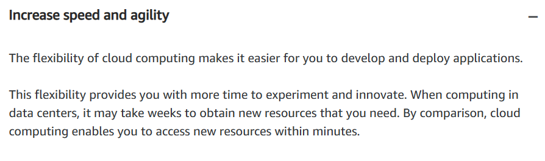

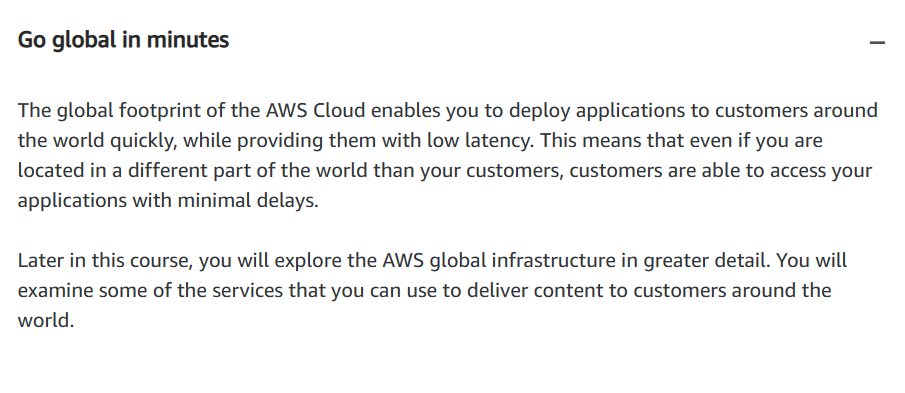
