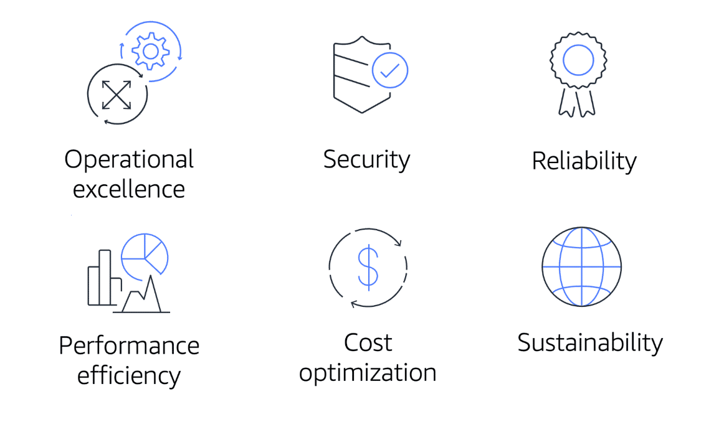

# The Cloud Journey

## The AWS Well-Architected Framework

- The **AWS Well-Architected Framework** *helps you understand how to design and operate reliable, secure, efficient, and cost-effective systems in the AWS Cloud*. 
- It provides *a way for you to consistently measure your architecture against best practices and design principles and identify areas for improvement*.

- The above are the *6 pillars of the Well-Architected Framework*:

1. **Operational excellence**

- *Ability to run and monitor systems to deliver business value and to continually improve supporting processes and procedures*. 

- Design principles for operational excellence in the cloud include: **Performing operations as code; Annotating documentation; Anticipating failure; Frequently making small, reversible changes**.

2. **Security**

- *Ability to protect information, systems, and assets while delivering business value through risk assessments and mitigation strategies*.

- When considering the security of you architecture, apply these best practices: **Automate security best practices when possible; Apply security at all layers; Protect data in transit and at rest**.

3. **Reliability**

- *Ability of a system to do the following: **Recover from infrastructure or service disruptions; Dynamically acquire computing resources to meed demand; Mitigate disruptions such as misconfigurations or transient network issues**. 
- *Reliability includes testing recovery procedures, scaling horizontally to increase aggregate system availability, and automatically recovering from failure*.

4. **Performance efficiency**

- *Ability to use computing resources efficiently to meet system requirements and to maintain that efficiency as demand changes and technology evolves.*
- Evaluating the performance efficiency of your architecture includes *experimenting more often, using serverless architectures, and designing systems to be able to go global in minutes*.

5. **Cost optimization**

- *Ability to run systems to deliver business value at the lowest price point*.
- *Cost optimization includes adopting a consumption model, analyzing and attributing expenditure, and using managed services to reduce the cost of ownership*. 

6. **Sustainability**

- *Ability to continually improve sustainability impacts by reducing energy consumption and increasing efficiency across all components of a workload by maximizing the benefits from the provisioned resources and minimizing the total resources required.*
- To facilitate good design for sustainability: **Understand your impact; Establish sustainability goals; Maximize utilization; Anticipate and adopt new, more efficient hardware and software offerings; Use managed services; Reduce the downstream impact of your cloud workload**.  

---