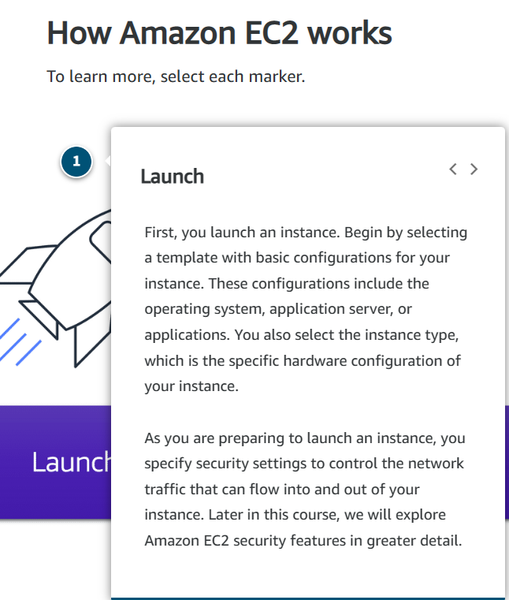
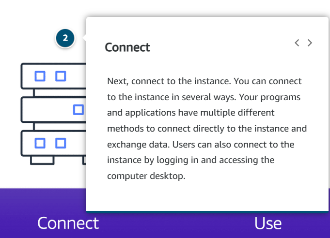
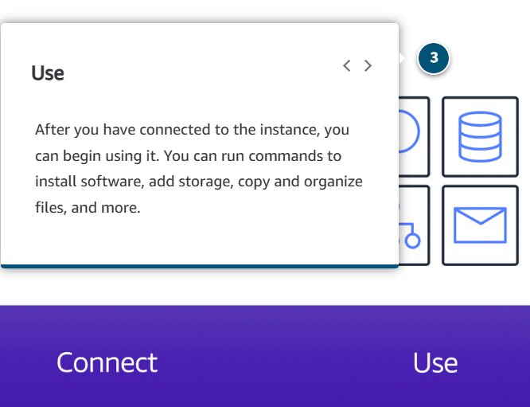
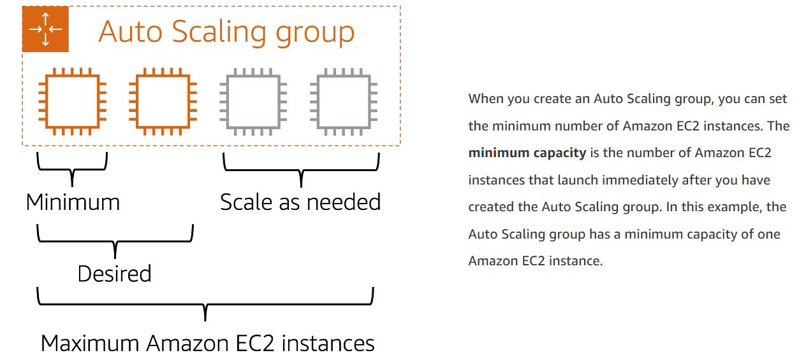
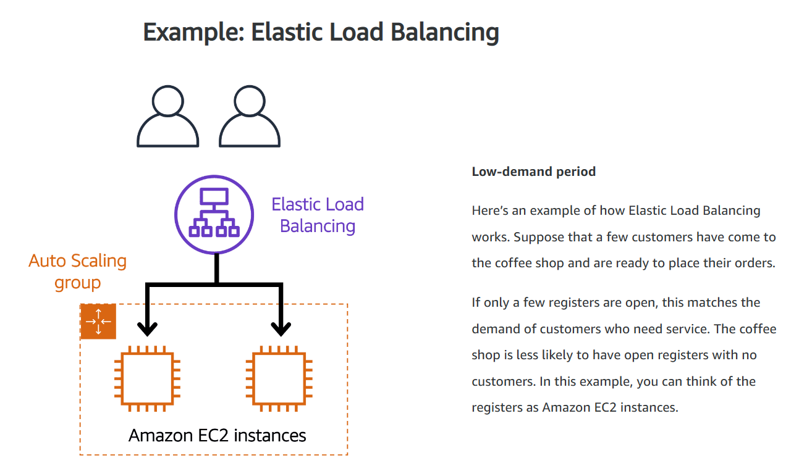
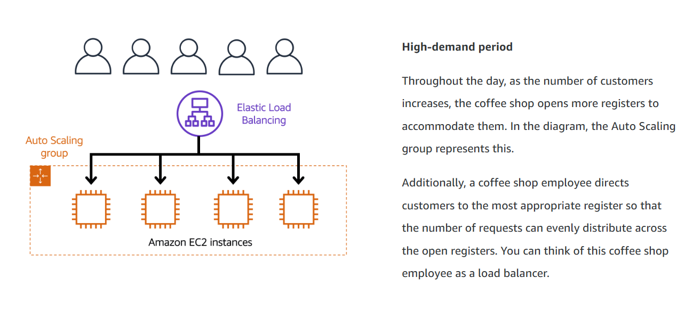
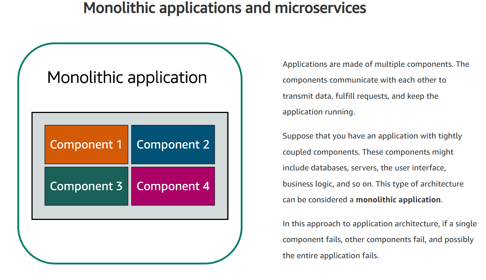
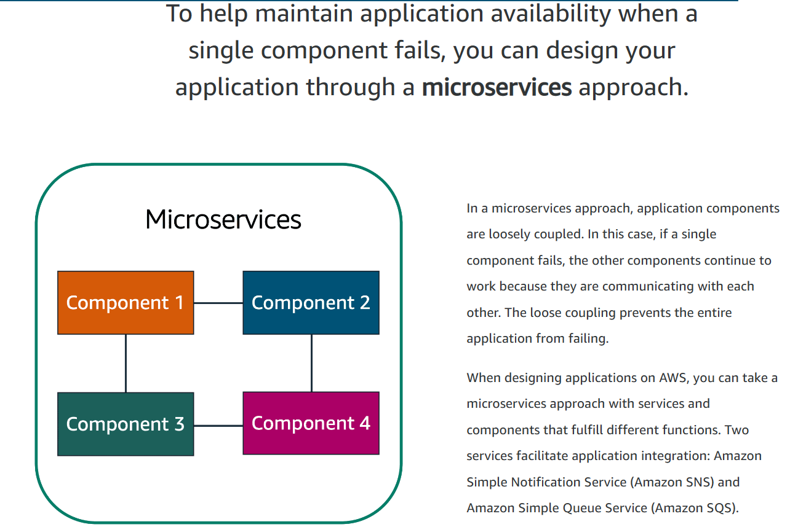
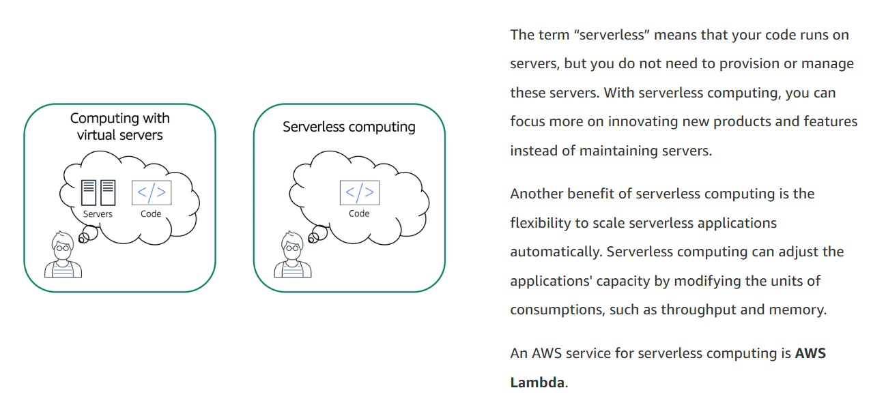
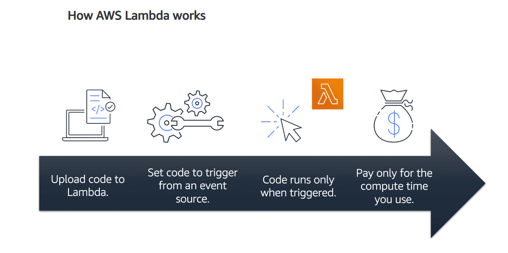

# Module 2: Compute in the Cloud
---

## EC2 -Elastic Compute Cloud-

- Regardless of industry, you use the Clint-Service model.
- You need servers to host you applications.
- Using EC2 Benefits: **Higly available, Cost-effective, Quick**.

### Benefits of going with AWS for your computing resources:
- AWS already **built the datacentres**.
- AWS already **secured these data centres**.
- AWS already **purchased servers**.
- AWS already **installed the servers**.
- AWS already **has the servers online and ready to use**.
- ***So you don`t have to!***

- With AWS resources, you *only pay for running instances*, not for when they are stopped or not needed anymore. 
---

## How does EC2 work?

- **Amazon Elastic Compute Cloud (Amazon EC2)** provides *secure, resizable compute capacity* in the cloud as **Amazon EC2 instances**. 
- EC2 runs on top of *physical host machines* managed by AWS using *virtualization technology*.
- When you spin up an EC2 instance, you are *sharing the host with multiple other instances*, otherwise known as **virtual machines**.
- A *hypervisor running on the host machine* is responsible for *sharing and coordinating the underlying physical resources between the virtual machines* = **Multitenancy**.
- The *hypervisor*, managed by AWS, is responsible for *isolating the virtual machines from each other as they share resources from the host*.
- This means **EC2 instances are secure**, as even though they may be *sharing resources, one EC2 instance is not aware of any other EC2 instances also on that host*, so they are **secure and separate** from each other.

- EC2 gives you a great deal of **flexibility and control**. Not only can you *spin up new servers or take them offline at will*, but you also have the *flexibility and control over the configuration of those instances*.

- When you provision an EC2 instance, you can *choose the operating system* based on either Windows or Linux.
- Uou also *configure what software you want running on the instance*. Whether it's your *own internal business applications, simple web apps, or complex web apps, databases or third party software*, like enterprise software packages.
- EC2 instances are also *resizable*. You might start with a small instance, realize the application you are running is starting to max out that server, and then you can give that instance more memory and more CPU = **Vertically scaling an instance**.
- You also *control the networking aspect of EC2*. So what type of *requests make it to your server and if they are publicly or privately accessible* is something you decide.  

--

## EC2 Instance types

### Each Amazon EC2 instance type is grouped under an instance family and are optimized for certain types of tasks:

1. **General purpose**

- Provide a good balance of compute, memory, and networking resources.
- Can be used for a variety of workloads: Web servers, Code repositories, etc. 

2. **Compute optimized**

- Ideal for compute intensive tasks: Gaming servers, HPC (High-performance computing), or Scientific modeling. 

3. **Memory optimized**

- Ideal for Memory intensive tasks that process large datasets in memory.
- As memory is a temporary storage area, it hold all the data and instructions that a CPU needs to be able to complete actions. Before a computer program or application is able to run, it is loaded from storage into memory. 

4. **Accelerated computing**

- Utilized for: Floating number point calculations, Graphics processing, and Data pattern matching.
- They utilize hardware accelerators or coprocessors, to perform some functions more efficiently than is possible in software running on CPUs. 
- A hardware accelerator is a component that can expedite data processing, which makes the Accelerated computing instances a great choice for graphics applications, game streaming, and application streaming. 

5. **Storage optimized**

- Ideal for workloads that require High, sequential read and write access to large datasets on local storage.
- Usecases can be Distributed file systems, Data warehousing applications, and high-frequency online transaction processing (OLTP) systems. 
- The terms Input/Output operations per second (IOPS) is a metric that measures the performance of a storage device (indicates how many different input/output operations a device can perform in one second).
- Storage optimized instances are designed to deliver tens of thousand of low-latency, random IOPS to applications. So, if you have an application that has high IOPS requirements, then Storage optimized instances are the best choice. 

---

## Amazon EC2 Pricing

- **On-demand** = only pay for the duration you use the instance (per hours/per second), depending on instance type and OS you choose to run.
- **Savings Plans** = offers low prices for EC2 in exchange of a commitment to a consistent amount of usage, measured in $/hour, for a 1 or 3-year term. Can provide savings up to 72% on your AWS compute usage over on-demand costs, regardless of region, instance family/type/config, etc. 
- **Reserved instances** = suited for steady states workloads or ones with predictable usage and offer you up to 75% discount vs. on-demand prices.You qualify for discount once you committed to a 1 or 3-year term and can pay for them with 3 payment options (all up-front, partial up-front, and no up-
front). 
- **Spot instances** = allow you to request spare AWS EC2 computing capacity for up to 90% of the on-demand price. The catch is, AWS can retrieve back the EC2 instances at any time, giving you a 2-minute warning to finish up your work and save the state, and you can resume later. When using these types of instances make sure the workload you`re handling can tolerate being interrupted. 
- **Dedicated hosts** = physical hosts dedicated for your use of EC2. These are usually for meeting certain compliance requirements, and nobody else will be sharing that host. 

---

## Scaling Amazon EC2

- **Scalability** =  involves beginning with only the resources you need and designing the architecture to automatically respond to changing demand by scaling out or in.
- If you want the process of scaling to happen automatically,you will use the EC2 functionality named AWS *EC2 AutoScaling*. 
-The *EC2 Autoscaling* enables you to **automatically add or remove EC2 instances in response to changing application demand**, which ensure a **higher sense of availability**. 
- Within EC2 Autoscaling you can use 2 approaches: *Dynamic scaling* (**responds to changing demands**) or *Predictive scaling* (**automatically schedules the right number of instances based on predicted demand**).

- In an Autoscaling Group you can also set a **desired capacity**, which refers to the number of instances that are desired to have running at all times. If you do not specify the desired number of EC2 instances, the desired capacity defaults to your minimum capacity.
- Lastly, you can set a **maximum capacity** which refers to the number of instances that the number should be increased to when there s demand arising. 

---

## Directing traffic with Elastic Load Balancing

- **Load Blancing** = application that takes in the requests and routes them to the instances to be processed.
- **AWS Elastic Load Balancer** = properly distributes traffic to ensure high performance, high availability, cost efficiency and is automatically scalable. 
- **AWS ELB** runs at a reginal level, not on an individual, instance-based level, which makes it highly available to begin with. It is also sutomatically scalable, which means that it can handle all the traffic that comes at it with no additional costs. 
- ELB acts as a single point of contact for all incoming web taffic to your Autoscaling Group. This means that as you add or remove EC2 instances in response to the amount of incoming traffic, these requests route to the load balancer first, which then spreads the traffic accross multiple resources to handle it. 

---

## Messaging and Queuing

- **Tightly coupled architecture** = when resources communicate directly. A main train of a tightly coupled architecture is if a single component fails/changes, it causes issues for the other comoponents or the entire system.  

For example, if App A tries to send a direct message to App B, but App B is experiencing some issues, the message will never be delivered. And this means that if the message was not delivered, and the App B failed, most likely there will be issues/ failures with App A.

- **Loosely coupled architecture** = single failure won`t cause cascading failures. 

For example, between App A and App B we will place a Buffer, or a Message queue. If App A is trying to send communications to App B, but App B is having issues, App A  doesn`t experience any issues, as all the messages are being stored in the Buffer and get send to tApp B when it is back up and running and ready to process messages.  

### Amazon SQS (Simple Queue Service)

- SQS allows you to *send, store and receive messages between software components, at any volume*, this is without loosing messages or without requiring other services to be available.
- **Payload** = Data contained within a message. It is protected until delivery. 
- *Amazon SQS queues* = where messages are placed until they are processedand AWS managed the underlying infrastructure for you to host those queues. They scale automatically, are reliable and are easy to configure and use.  

### Amazon SNS (SimpleNotification Service)

- *Amazon SNS* is used to send out messages to services, but it can also send out notifications to end users.
- It does this in a different way called a **publish/subscribe or pub/sub model**. This means that you can *create something called an **SNS topic** which is just a channel for messages to be delivered*.
- You can then *configure subscribers to that topic* and finally *publish messages for those subscribers*. 
- In practice, that means you can *send one message to a topic which will then fan out to all the subscribers in a single go*. These subscribers can also be endpoints such as SQS queues, AWS Lambda functions, and HTTPS or HTTP web hooks. 
- Additionally, SNS can be used to fan out notifications to end users using *mobile push, SMS, and email*.

---

## Additional Compute Services

- **Serverless** = You cannot see or access the underlying infrastructure or instances that are hosting your application. Instead, all the management of the underlying environment, from a provisioning, scaling, high-availability, and maintenance perspective are taken care of for you. 

### **AWS Lambda** = serverless compute option.

- Lambda is a service that allows you to *upload your code into what's called a **Lambda function**, configure a trigger and from there, the service waits for the trigger*. When the trigger is detected, the *code is automatically run in a managed environment*, an environment you do not need to worry too much about because it is automatically scalable, highly available and all of the maintenance in the environment itself is done by AWS.
- If you have one or 1,000 incoming triggers, Lambda will scale your function to meet demand. Lambda is designed to run code under 15 minutes so this isn't for long running processes like deep learning. It's more suited for quick processing like a web backend, handling requests or a backend expense report processing service where each invocation takes less than 15 minutes to complete. 

### AWS Container Services: Amazon Elastic Container Service (ECS) or Amazon Elastic Kubernetes Service (EKS) 

- Both of these services are *container orchestration tools* (in AWS, Docker Containers).

 *Docker* = a widely used platform that uses **operating system level virtualization to deliver software in containers**. 
 
 *Container* = a **package for your code where you package up your application, its dependencies as well as any configurations that it needs to run**.
- In AWS, these *containers run on top of EC2 instances and run in isolation from each other*, similar to how virtual machines work, but in this case, the host is an EC2 instance.
- When you use Docker containers on AWS, you need *processes to start, stop, restart, and monitor containers running across not just one EC2 instance, but a number of them together* which is called a **Cluster**. The process of doing these tasks is called **container orchestration**.
- *Orchestration tools* were created to help you *manage your containers*. **ECS** is designed to *help you run your containerized applications at scale without the hassle of managing your own container orchestration software*. **EKS** does a *similar thing, but uses different tooling and with different features*. Both Amazon ECS and Amazon EKS can run on top of EC2.

### AWS Fargate

- If you do not want to use EC2 to host your container either because you do not need access to the underlying OS, or you do not want to manage the EC2 instances, you can use a compute platform called AWS Fargate. 
- **AWS Fargate** = serverless compute platform for ECS or EKS 

### Which one to use?

1. If you are trying to *host traditional applications and want full access to the underlying operating system* like Linux or Windows, you are going to want to use **EC2**.

2. If you are looking to *host short running functions, service-oriented or event driven applications and you don't want to manage the underlying environment at all*, look into the serverless **AWS Lambda**.

3. If you are looking to *run Docker container-based workloads on AWS*, you first need to choose your orchestration tool. Do you want to use **Amazon ECS or Amazon EKS**? 

4. After you choose your orchestration tool, you then need to chose your platform. *Do you want to run your containers on EC2 instances that you manage or in a serverless environment like AWS Fargate that is managed for you*? 
