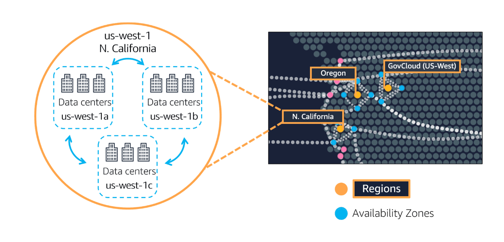
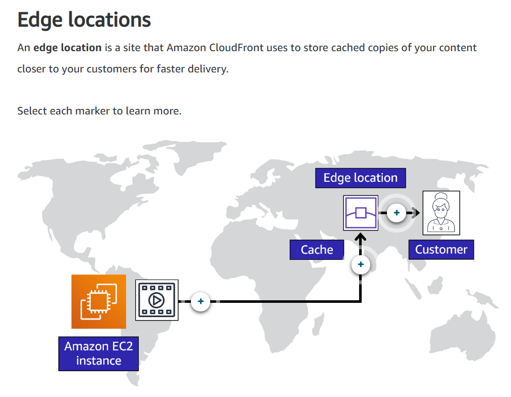
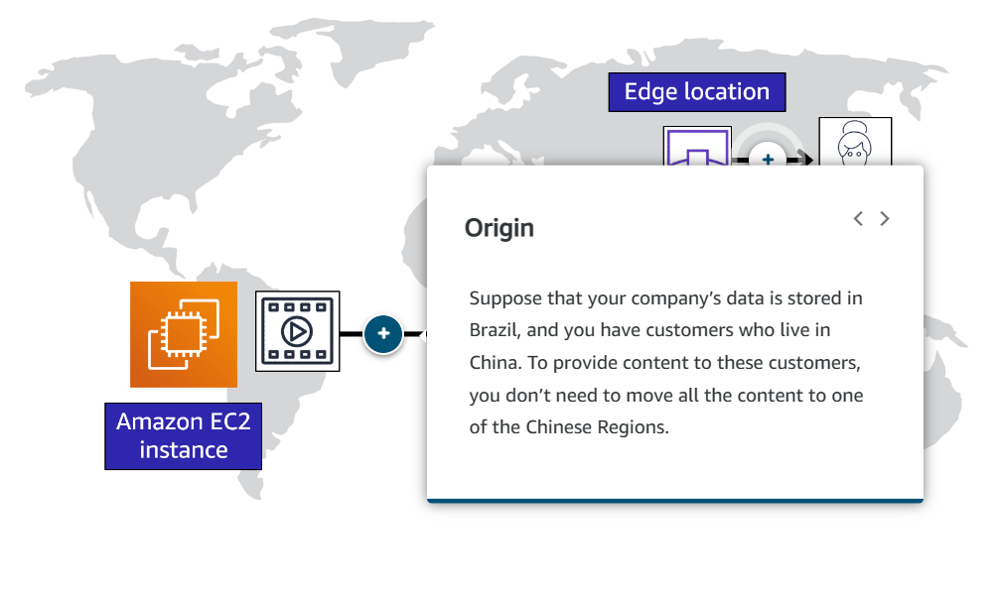
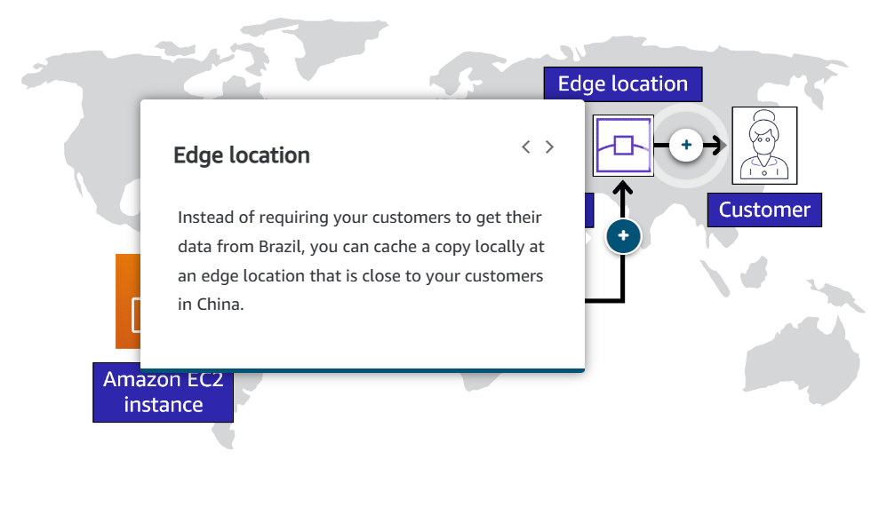
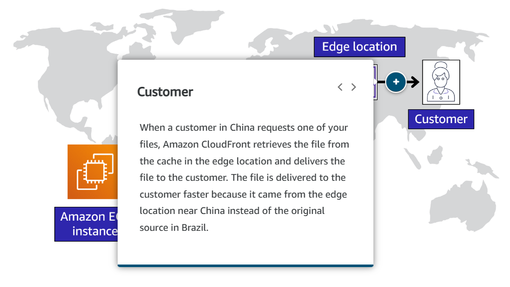
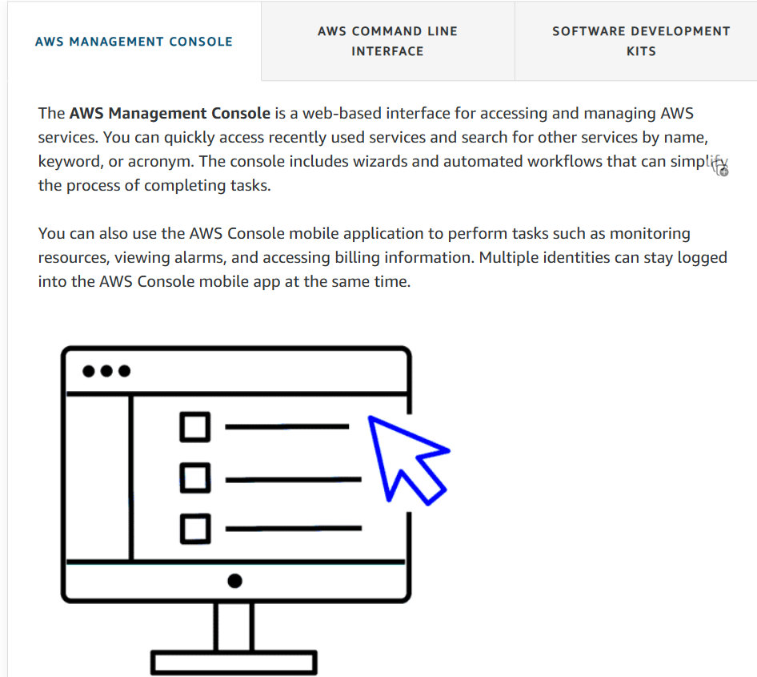
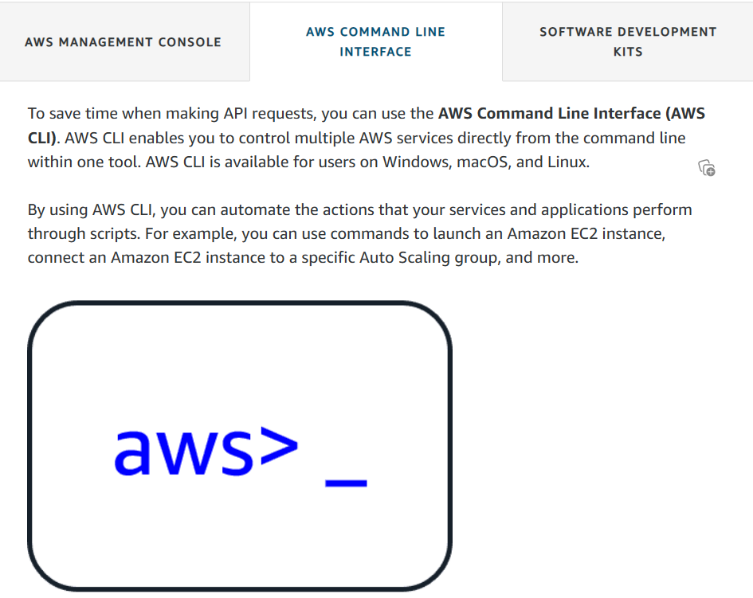
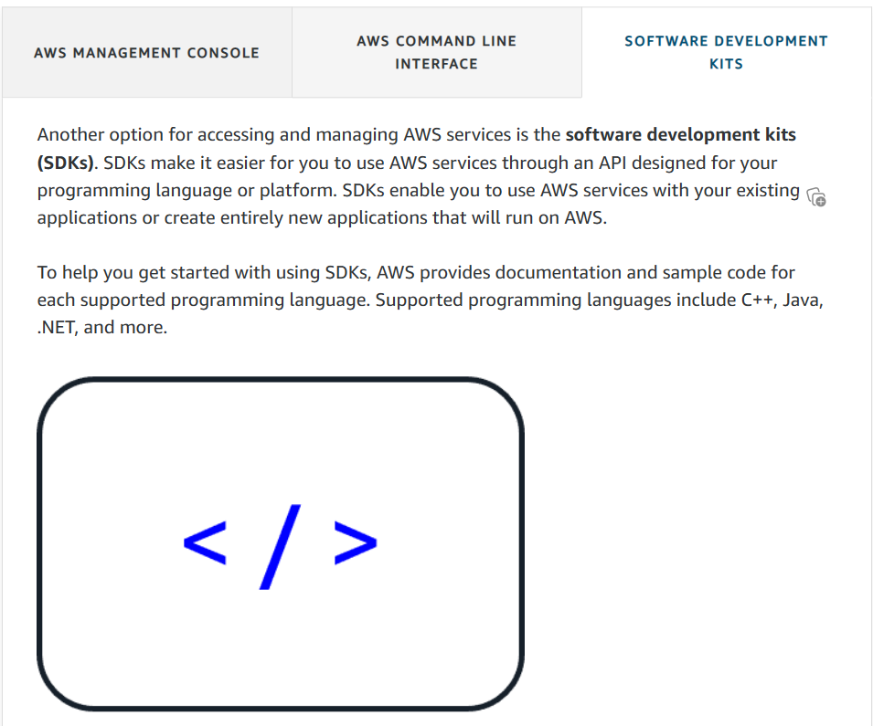

# Global Infrastructure and Reliability

## AWS Global Infrastructure

- AWS builds its Data Centres in large groups = **Regions**.
- AWS builds Regions throughout the Globe to be as close as possible to where the business traffic demands (e.g. Paris, Tokyo, London, Ohio, Sao Paolo, Dublin, etc.).
- Each region has multiple Data Centres equiped with Compute, Storage, everything you need for your business.
- Each region can be connected to each other region through High Speed Fiber Network. Hence why you can use resources from an opposite corner of the world, if need be. 
- Keep in mind that, each region runs individually, so whichever region you choose to run your business in, your data is stored in that region and that region only, unless you EXPLICITLY choose to move it across regions. 
- Let`s say you have Governament Compliance Requirements that your financial data in Frankfurt cannot leave Germany. Well, this is the way that AWS opperates out of the box. Any data stored, say in the Frankfurt region, STAYS in the Frankfurt region, unless of course, you give your consent with the right credentials and permissions.

### ***How do you choose a region?***

1. **Compliance** = before anything else, you must first look at your compliance requirements. Do you have any requirements that your data MUST live in a specific region/country?

2. **Proximity** = how close you are to your customer base? If most your customers live in Singapore, for example, it`s a better choice to choose the Singapore region, to avoid latency. 

3. **Feature availability** = some of the regions may not have all the features/resources you need. And, although AWS is trying to always provide all the resources in all its regions, sometimes it is not the case, as building resources can take time. So, always make sure that the region you choose has the resources/features you need available. 

4. **Pricing** = some locations are more expensive to operate (e.g. Brazil), wether it is due to government financial laws, business requirements. Know that every region has its own pricing sheet, so if you are on a budget, and cost-efficiency is always at the top of your priorities, make sure you check the pricing on the area you are considering, to make sure you make the best decision for your business.

---

## Availability Zones

- **Availability Zone** = a *single data center or a group of data centers within a Region*. They are located *tens of miles apart from each other*. This is close enough to have **low latency** (the time between when content requested and received) between Availability Zones. However, if a disaster occurs in one part of the Region, they are *distant enough to reduce the chance that multiple Availability Zones are affected*.

---

## Edge Locations

---

## How to provision AWS resources

- AWS provides different methods/tools of interacting, creating, configuring and managing resources.

- All of the above methods are *do it yourself(manually)* options of provisioning AWS resources, as you have to either point and click, write scripts, or write programs.
- However, as automation is really important, and repetitive tasks can be very time consuming, AWS offers *managed services that can help you provision your resources*.

### ***AWS Elastic Beanstalk***

- With AWS **Elastic Beanstalk**, you provide code and configuration settings, and Elastic Beanstalk deploys the resources necessary to perform the following tasks:

1. Adjust capacity.
2. Load Balancing.
3. Automatic scaling. 
4. Application health management. 

### ***AWS CloudFormation***

- With AWS **CloudFormation**, you can treat you *Infrastructure as Code*. This means that you can *build an environment by writing lines of code* instead of using the AWS Console Management to manually provision resources.

- CloudFormation *provisions your resources in a safe, repeatable manner, enabling you to frequently build your infrastructure and applications without having to perform manual actions*. 
- It *determines the right operations to perform when managing your stack and **rolls back changes automatically if it detects errors***. 

---