# Networking

##  Connectivity to AWS

- Amazon **Virtual Private Cloud (VPC)**, lets you provision a *logically isolated section of the AWS Cloud where you can launch AWS resources in a virtual network that you define*.
- These resources can be *public facing* so they have access to the internet, or *private facing* with no internet access, usually for backend services like databases or application servers. 
- The *public and private grouping of resources* are known as **subnets** and they are *ranges of IP addresses in your VPC*.

### Internet Gateway

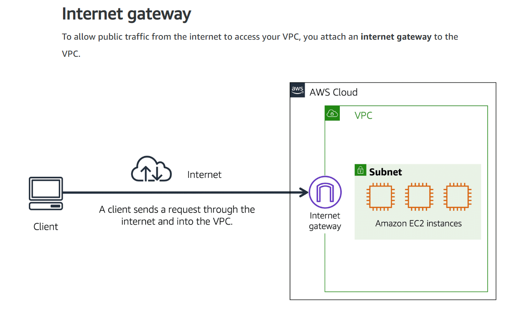

- An **internet gateway** is a connection between a VPC and the internet. You can think of an internet gateway as being similar to a door that yo use to enter your house. Without an internet gateway, nobody can access the resources within your VPC.

### Virtual Private Gateway

- What if your VPC contains only private resources? You still need a secure way of accessing your resources without allowing anyone else from the internet to access them. In this case you would use a **Virtual Private gateway**.
- The **virtual private gateway** is the *component that allows protected internet traffic to enter into the VPC*. 
- A virtual private gateway enables you to *establish a virtual private network (VPN) connection between your VPC and a private network*, such as an on-premises data center or internal corporate network. It *allows traffic into the VPC only if it is coming from an approved network*.

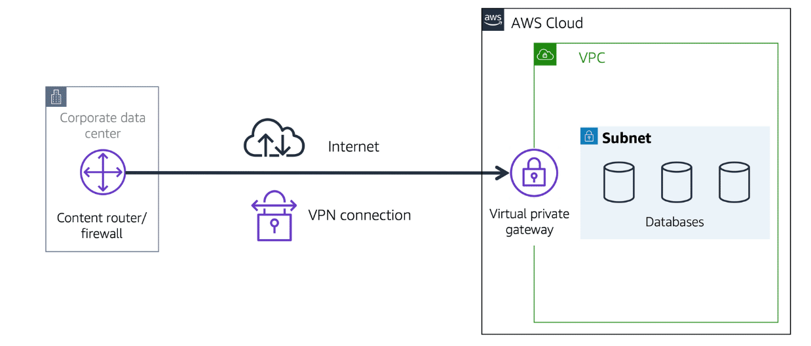

### AWS Direct Connect

- **AWS Direct Connect** is a service that *enables you to establish a dedicated private connection between your data center and a VPC*.

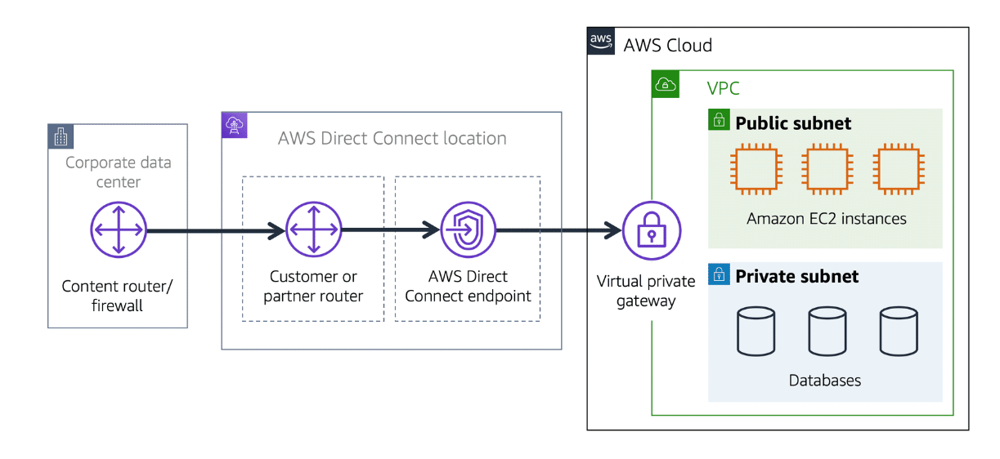

- The private connection that AWS Direct Connect provides helps you to *reduce network costs and increase the amount of bandwidth that can travel through your network*.

---

## Subnets and network acces control lists

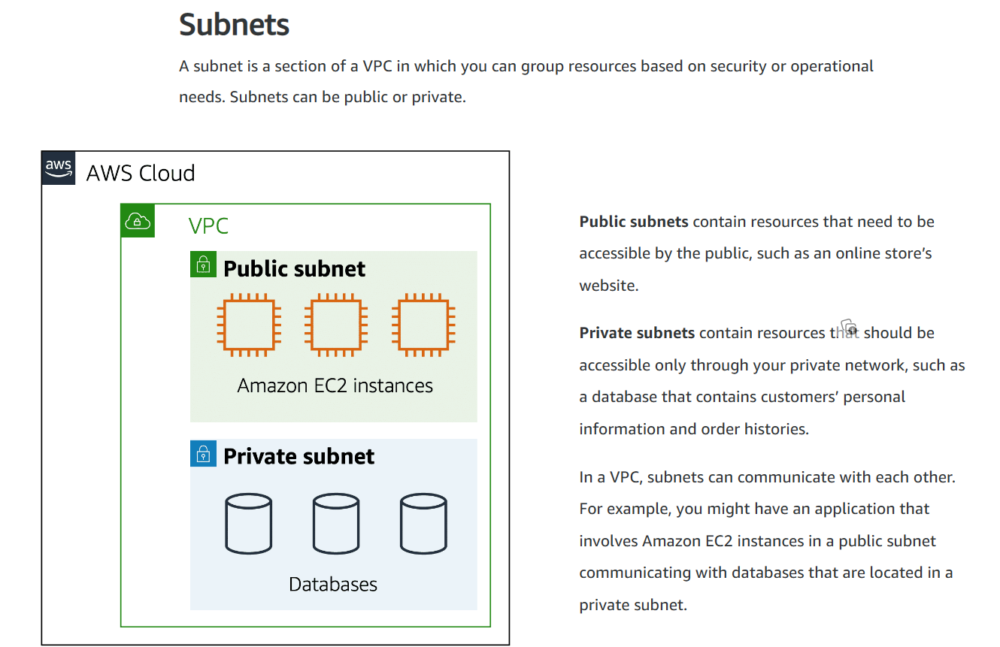

### ***Network traffic in a VPC***

-When a customer requests data from an application hosted in the AWS Cloud, this request is sent as a packet. A **packet** is *a unit of data sent over the internet or a network*.

- The packet enter into a VPC through an *internet gateway*, but before it can enter into a subnet within the VPC or exit from a subnet, it is checked for permissions. These permissions indicate who sent the package and how the packet is trying to communicate with the resources in a subnet. 
- The VPC component that check packets for permissions to enter/exit a subnet is called a **Network Access Control List (Network ACL)**.

- A **Network access control list (ACL)** is a *virtual firewall that controls inbound and outbound traffic at the subnet level*.

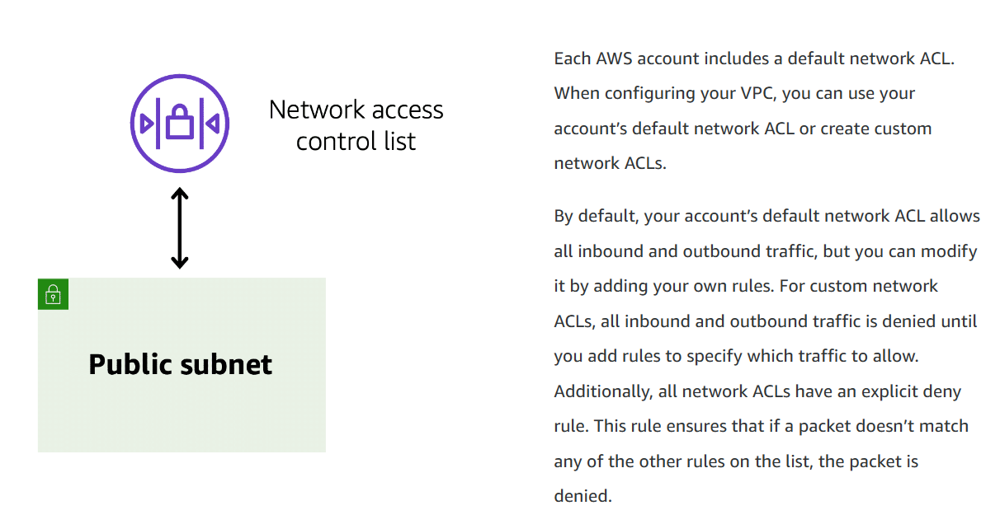

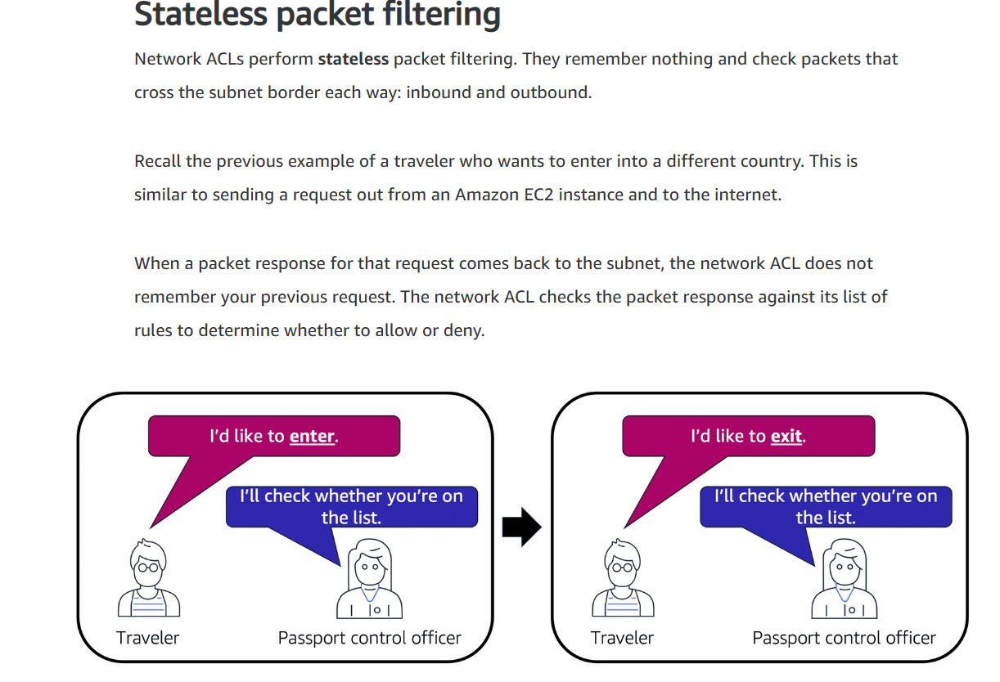

- After a packet has entered a subnet, it must have its permissions evaluated for resources within the subnet, such as Amazon EC2 instances. The *VPC component that checks packet permissions for an Amazon EC2 instance* is a **Security group**.

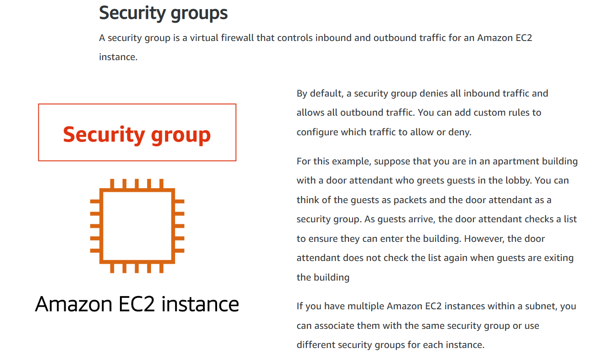

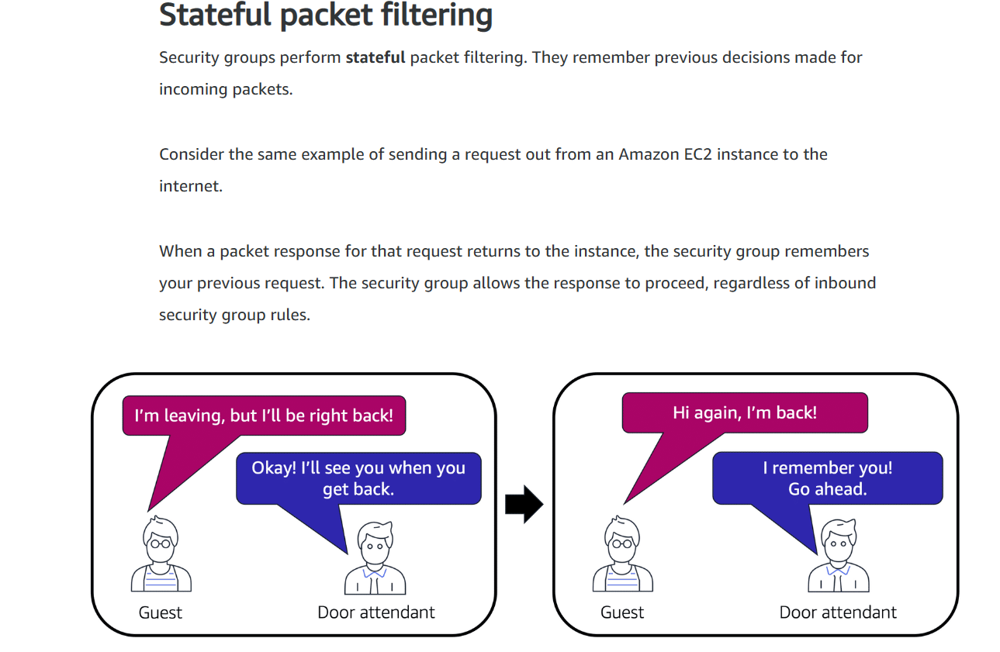

- Both **Network ACLs and Security groups** *enable you to configure custom rules for the traffic in your VPC*.

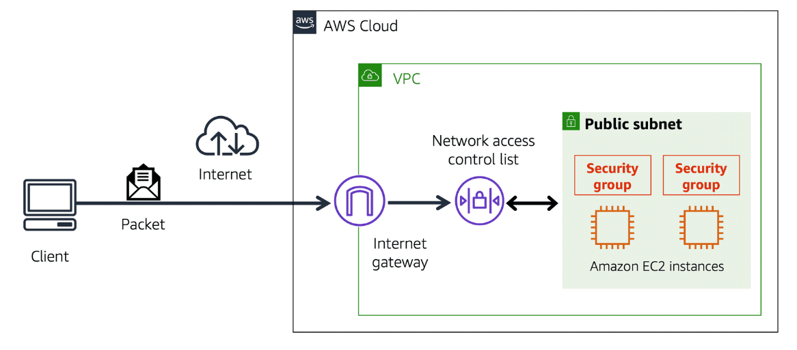

---

## Global Networking

- Suppose that X company has a website hosted in the AWS Cloud. Customers enter the web address into their browser, and they are able to access the website. This happens because of **Domain Name System (DNS)** resolution. *DNS resolution involves a customer DNS resolver communicating with a company DNS server.*

- You can think of **DNS** as being the phone book of the internet. **DNS resolution** is the *process of translating a domain name to an IP address*. 

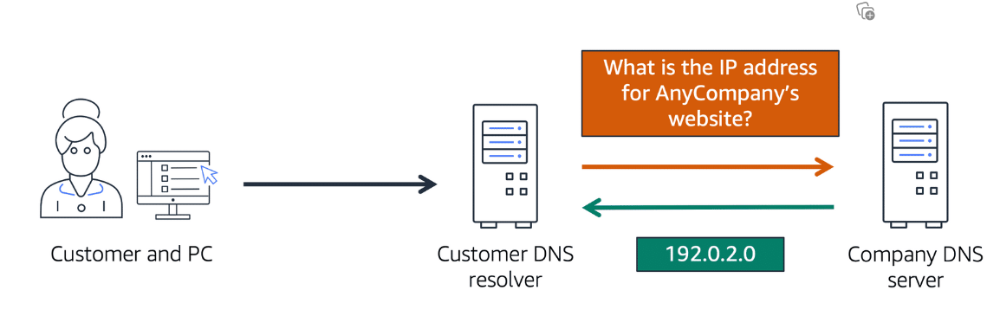

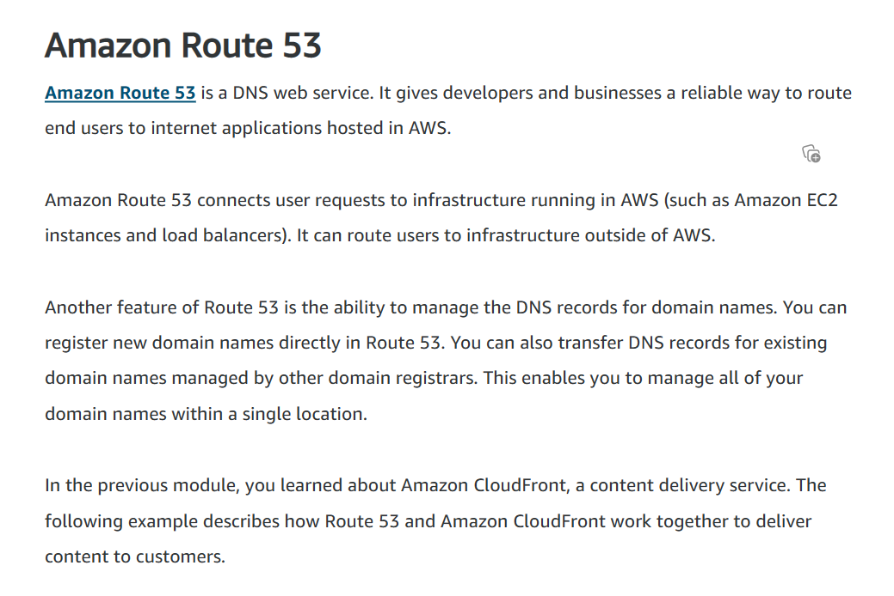

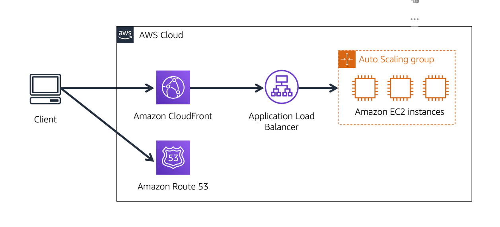

- To understand the example above,imagine that X company`s *application is running on several EC2 instances that are in an Autoscaling Group that attaches to a Load Balancer*.
- A *customer requests data from the app by going to X company`s website*.
- Then, *Amazon Route 53 uses DNS resolution to identify X company`s.com corresponding IP address*, and this *info is sent back to the customer*.
- The *customer`s request is sent to the nearest Edge Location though Amazon CloudFront, which then connects to the Load Balancer, which lastly sends the incoming packet to an EC2 instance*. 

