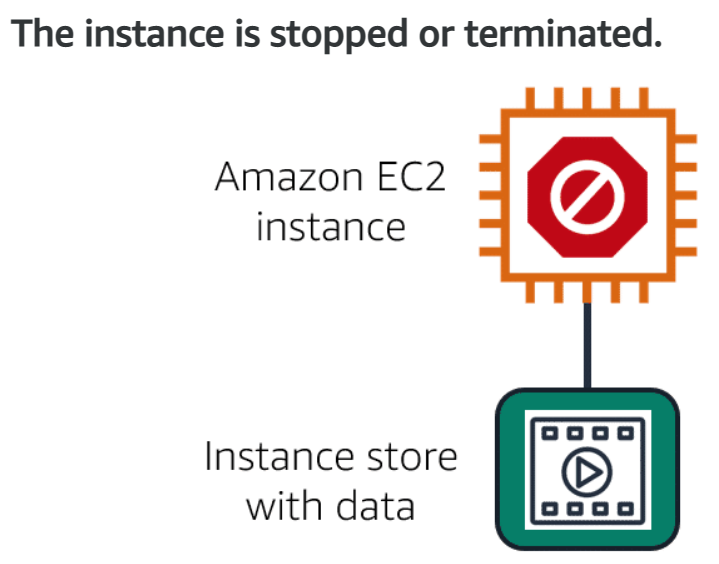

# Storage and Databases

## Instance stores and Elastic Block Store (AWS EBS)

- **Block-level storage volumes** behave like *physical hard drives*.

- An **instance store** provides ***temporary** block-level storage* for an Amazon EC2 instance. It is *disk storage that is physically attached to the host computer* for an EC2 instance, and therefore *has the same lifespan as the instance*. When the *instance is terminated, you lose any data in the instance store*.

- Amazon *EC2 instances are virtual servers*. If you *start an instance from a stopped state, the instance might start on another host*, where the **previously used instance store volume does not exist**. Therefore, AWS recommends instance stores for use cases that involve temporary data that you do not need in the long term.

### **Amazon Elastic Block Store (EBS)**

- **EBS** is a service that *provides block-level storage volumes* that you can use with Amazon EC2 instances. If you *stop or terminate an Amazon EC2 instance, all the data on the attached EBS volume remains **available***.

- To create an EBS volume, you *define the configuration (such as volume size and type) and provision it*. 
- After you create an EBS volume, it can attach to an Amazon EC2 instance.

- Because *EBS volumes are for data that needs to persist*, it’s important to **back up the data**. 
- You can take **incremental backups** of EBS volumes by creating Amazon **EBS snapshots**.

- An **EBS snapshot** is an *incremental backup*. This means that the *first backup taken of a volume copies **all** the data*. For *subsequent backups, only the blocks of data that have changed* since the most recent snapshot are saved. 

---

## Amazon Simple Storage Service (S3)

- In **Object storage**, each *object consists of data,metadata, and a key*. 

- The *data might be an image, video, text document, or any other type of file*. **Metadata** contains *information about what the data is, how it is used, the object size, and so on*. An **object’s key** is *its unique identifier*.

- **Amazon Simple Storage Service (Amazon S3)** is a service that *provides object-level storage* (*stores data as objects in buckets*).

- You can *upload any type of file to Amazon S3*, such as images, videos, text files, and so on. For example, you might use Amazon S3 to store backup files, media files for a website, or archived documents. **Amazon S3 offers unlimited storage space. The maximum file size for an object in Amazon S3 is 5 TB**.

- When you upload a file to Amazon S3, you can *set permissions to control visibility and access to it*. You can also use the **Amazon S3 versioning feature** to *track changes to your objects over time*.

- With Amazon S3, you pay only for what you use and you can choose from a range of storage classes to select a fit for your business and cost needs.
- When selecting an Amazon S3 storage class, consider these two factors:

1. How often you plan to retrieve your data?
2. How available you need your data to be?

### **Amazon S3 storage classes**

1. **Amazon S3 Standard**

- Designed for *frequently accessed data*.
- *Stores data in a minimum of three Availability Zones*.
-  Ensures *high availability for objects*.
- A good choice for a wide range of use cases, such as websites, content distribution, and data analytics.
- Has a *higher cost* than other storage classes intended for infrequently accessed data and archival storage.

2. **Amazon S3 Standard-Infrequent Access (S3 Standard-IA)**

- Ideal for *data infrequently accessed but requires high availability when needed*.
- Stores data in a *minimum of three Availability Zones*.
- Provides the *same level of availability as Amazon S3 Standard* but with a *lower storage price and a higher retrieval price*.

3. **Amazon S3 One Zone-Infrequent Access (S3 One Cone-IA)**

- Stores data in a *single Availability Zone*.
- Has a *lower storage price than Amazon S3 Standard-IA*.
- A good storage class to consider if 
*you want to save costs on storage* or 
*you can easily reproduce your data in the event of an Availability Zone failure*.

4. **Amazon S3 Intelligent-Tiering**

- Ideal for *data with unknown or changing access patterns*.
- Requires a *small monthly monitoring and automation fee per object*.
- In this class, **Amazon S3 monitors objects’ access patterns**. If *you haven’t accessed an object for 30 consecutive days, Amazon S3 automatically moves it to the infrequent access tier, Amazon S3 Standard-IA*. If you *access an object in the infrequent access tier, Amazon S3 automatically moves it to the frequent access tier, Amazon S3 Standard*.

5. **Amazon S3 Glacier Instant Retrieval**

- Works well for *archived data that requires immediate access*.

- You can *retrieve your objects stored in the Amazon S3 Glacier Instant Retrieval storage class within **milliseconds***, with *the same performance as Amazon S3 Standard*.

6. **Amazon S3 Glacier Flexible Retrieval**

- *Low-cost storage designed for data archiving*.
- Able to *retrieve objects within a few minutes to hours*.
- For example, you might use this storage class to store archived customer records or older photos and video files.

7. **Amazon S3 Glacier Deep Archive**

- **Lowest-cost** *object storage class ideal for archiving*.
- Able to *retrieve objects within 12-48 hours*.
- Amazon S3 Deep Archive *supports long-term retention and digital preservation for data that might be accessed once or twice in a year*.
- All *objects from this storage class are replicated and stored across at least **three geographically dispersed Availability Zones***.

8. **Amazon S3 Ouposts**

- Creates *S3 buckets on Amazon S3 Outposts*.

- Makes it easier to *retrieve, store, and access data on AWS Outposts*.

- *Delivers object storage to your on-premises AWS Outposts environment*.
- Designed to *store data durably and redundantly across multiple devices and servers on your Outposts*. 
- It works well for *workloads with local data residency requirements that must satisfy demanding performance needs by keeping data close to on-premises applications*.

---

## Amazon Elastic File System (EFS)

- In **file storage**, *multiple clients (such as users, applications, servers, and so on) can access data that is stored in **shared file folders***. 
- In this approach, *a storage server uses block storage with a local file system to organize files*. *Clients access data through file paths*.

- *Compared to **block storage** and **object storage**, ***file storage** is ideal for use cases in which a large number of services and resources need to access the same data at the same time*.

- **Amazon Elastic File System (Amazon EFS)** is a *scalable file system used with AWS Cloud services and on-premises resources*. 
- As *you add and remove files, Amazon EFS grows and shrinks automatically*. 
- It can **scale on demand to petabytes without disrupting applications**. 

---

## Amazon Relational Database Service

- In a **relational database**, *data is stored in a way that relates it to other pieces of data*. 

- **Relational databases** use *structured query language (SQL) to store and query data*. 
- This approach *allows data to be stored in an easily understandable, consistent, and scalable way*. For example, the coffee shop owners can write a SQL query to identify all the customers whose most frequently purchased drink is a medium latte.

### **Amazon Relational Database Service**

- **Amazon Relational Database Service (Amazon RDS)** is a *service that enables you to run relational databases in the AWS Cloud*.

- **Amazon RDS** is a *managed service that automates tasks such as hardware provisioning, database setup, patching, and backups*. 
- You can *integrate Amazon RDS with other services* to fulfill your business and operational needs, such as using *AWS Lambda to query your database from a serverless application*.

- **Amazon RDS** provides a number of *different security options*. *Many Amazon RDS database engines offer **encryption at rest (protecting data while it is stored) and encryption in transit (protecting data while it is being sent and received)***.

  

   ***Amazon RDS database engines:***

- **Amazon RDS** is *available on six database engines*, which *optimize for memory, performance, or input/output (I/O)*. Supported database engines include:

1. Amazon Aurora
2. PostgreSQL
3. MySQL
4. MariaDB
5. Oracle Database
6. Microsoft SQL Server

### **Amazon Aurora**

- An **enterprise-class relational database**. 
- It is *compatible with MySQL and PostgreSQL relational databases*. 
- It is *up to five times faster than standard MySQL databases and up to three times faster than standard PostgreSQL databases*.

- Helps to *reduce your database costs by reducing unnecessary input/output (I/O) operations, while ensuring that your database resources remain reliable and available.* 

- Perfect for *workloads that require high availability*. 
- It **replicates six copies of your data across three Availability Zones and continuously backs up your data to Amazon S3.**

---

## Nonrelational Databases and Amazon DynamoDB

- In a **nonrelational database**, you create *tables*, which is *a place where you can store and query data*.

- **Nonrelational databases are sometimes referred to as “NoSQL databases”** because *they use structures other than rows and columns to organize data.*
- One type of structural approach for nonrelational databases is **key-value pairs.**
- With *key-value pairs*, data is organized into **items (keys)**, and **items have attributes (values)**. You can think of *attributes as being different features of your data*.

- In a **key-value database**, you can *add or remove attributes from items in the table at any time*. Additionally, *not every item in the table has to have the same attributes*.

### ***Amazon DynamoDB***

- **Amazon DynamoDB** is a *key-value database service*. It *delivers single-digit millisecond performance at any scale*.

---

## Amazon Reddhift

- **Amazon Redshift** is a *data warehousing service that you can use for big data analytics*.
- It offers the *ability to collect data from many sources and helps you to understand relationships and trends across your data*.

---

## AWS Database Migration Service (DMS)

- **AWS Database Migration Service (AWS DMS)** enables you to *migrate relational databases, nonrelational databases, and other types of data stores*.

- With **AWS DMS**, you *move data between a source database and a target database*. The **source and target databases can be of the same type or different types**. 
- *During the migration, your source database remains **operational**, reducing downtime for any applications that rely on the database.*

- For example, suppose that you have a MySQL database that is stored on premises in an Amazon EC2 instance or in Amazon RDS. Consider the MySQL database to be your source database. Using AWS DMS, you could migrate your data to a target database, such as an Amazon Aurora database.

- Other use cases for AWS DMS:

1. Development and test database migration.

2. Database Consolidation.

3. Continuous replication.

---

## Additional database services

1. **Amazon DocumentDB**

- **Amazon DocumentDB is a document database service** that *supports MongoDB workloads (MongoDB is a document database program.)*.

2. **Amazon Neptune**

- **Amazon Neptune is a graph database service** that you can use to *build and run applications that work with highly connected datasets, such as recommendation engines, fraud detection, and knowledge graphs*.

3. **Amazon Quantum Ledger Database (Amazon QLDB)**

- **Amazon Quantum Ledger Database (Amazon QLDB) is a ledger database service** that you can use to *review a complete history of all the changes that have been made to your application data.*

4. **Amazon Managed Blockchain**

- **Amazon Managed Blockchain** is a service that you can use to *create and manage blockchain networks with open-source frameworks*. 

- **Blockchain** is a *distributed ledger system that lets multiple parties run transactions and share data without a central authority*.

5. **Amazon ElastiCache**

- **Amazon ElastiCache** is a service that *adds caching layers on top of your databases to help improve the read times of common requests*. 
- It *supports two types of data stores: **Redis and Memcached***.

6. **Amazon DynamoDB Accelerator**

- **Amazon DynamoDB Accelerator (DAX)** is an *in-memory cache for DynamoDB*. 
- It helps *improve response times from single-digit milliseconds to microseconds*.

---

### ***Main takeaway in this Module is that there is no one-size database type that can fit all business needs. But rather, each database type is tailored to answer a specific business need. It is up to you topick the one that suits your needs.***

---