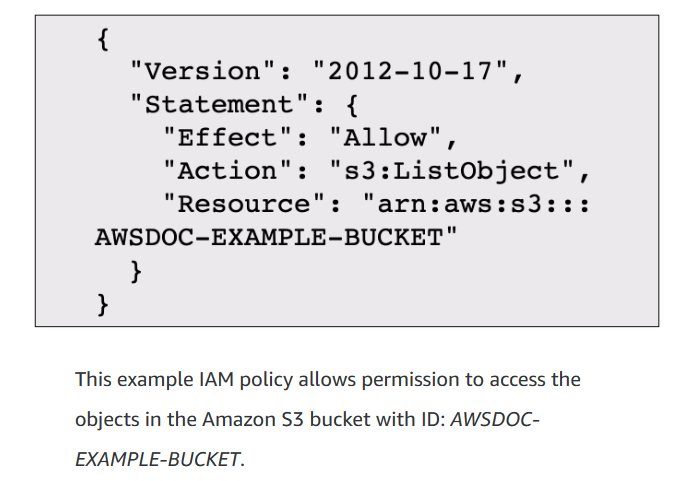

# Security

## Shared Responsibility Model

- You wonder who is responsible for the security in the cloud? Is it AWS or yourself? The answer is **both**.
-  The reason is that you do not treat your AWS environment as a single object. Rather, you treat the environment as a *collection of parts that build upon each other.*
-  AWS is responsible for some parts of your environment and you (the customer) are responsible for other parts. This concept is known as the **shared responsibility model.**

- Let`s look at the EC2 example:

- As a summary, **AWS takes care of the security *of* the cloud, while the customer takes care of the security *in* the cloud.**

---

## User Permissions and Access

### ***AWS Identity and Access Management (IAM)***

- **AWS Identity and Access Management (IAM)** enables you to manage access to AWS services and resources securely. 
- IAM gives you the *flexibility to configure access based on your company’s specific operational and security needs*. 
- You do this by using a combination of IAM features:

1. **IAM users, groups, and roles**
2. **IAM policies**
3. **Multi-factor authentication**

### ***Root user***

- Think of the *Root User* as a business owner. It has access to everything (in this case, can do anything in AWS). You login to the Root User with your email and password. 
- ***You should not use the Root user for day-to-day tasks.***

### ***IAM Users***

- An *IAM user* is an **identity that you create in AWS**. It represents the *person or application that interacts with AWS services and resources*. 
- It consists of a name and credentials.
- By default, when you create a new IAM user in AWS, it has **no permissions associated with it**. 
- To allow the IAM user to perform specific actions in AWS, you must *grant the IAM user the necessary permissions*.

### ***IAM Policies***

- An *IAM policy* is a **JSON document that allows or denies permissions to AWS services and resources**.  

- IAM policies enable you to *customize users’ levels of access to resources*. 
- Follow the **security principle of least privilege** when granting permissions. 
- By following this principle, you help to *prevent users or roles from having more permissions than needed to perform their tasks*. 

### ***IAM Groups***

- An *IAM group* is a **collection of IAM users**. When you assign an IAM policy to a group, *all users in the group are granted permissions specified by the policy*.

### ***IAM Roles***

- An *IAM role* is an **identity that you can assume to gain temporary access to permissions**.  

- Before an IAM user, application, or service can assume an IAM role, they must be *granted permissions to switch to the role*. 
- When someone assumes an IAM role, they **abandon all previous permissions that they had under a previous role and assume the permissions of the new role.** 
- IAM roles are *ideal for situations in which access to services or resources needs to be granted temporarily, instead of long-term*.  

### ***Multi-factor Authentication***

- In IAM, *multi-factor authentication (MFA)* provides an **extra layer of security for your AWS account**.

- Options for MFA devices: hardware security key, a hardware device, or an MFA application on a device such as a smartphone.

---

## AWS Organizations

- **AWS Organizations** allows you to *consolidate and manage multiple AWS accounts within a central location*.

- When you create an organization,* AWS Organizations automatically creates a root*, which is the **parent container for all the accounts in your organization**. 

- In AWS Organizations, you can centrally *control permissions for the accounts in your organization by using **service control policies (SCPs)***. 
- SCPs enable you to *place restrictions on the AWS services, resources, and individual API actions that users and roles in each account can access*, and also *consolidate billing*.

- In AWS Organizations, you can *group accounts into **organizational units (OUs)** to make it easier to manage accounts with similar business or security requirements*. 
- When you apply a policy to an OU, *all the accounts in the OU automatically inherit the permissions specified in the policy*.  

---

## Compliance
 
- Depending on your company’s industry, you may need to uphold **specific standards**. An audit or inspection will ensure that the company has met those standards.

- **AWS Artifact** is a service that *provides on-demand access to AWS security and compliance reports and select online agreements*. 
- AWS Artifact consists of two main sections: **AWS Artifact Agreements and AWS Artifact Reports**.

1. **AWS Artifact Agreements**

- Suppose that your company needs to sign an agreement with AWS regarding your use of certain types of information throughout AWS services. You can do this through AWS Artifact Agreements. 
- In **AWS Artifact Agreements**, you can *review, accept, and manage agreements for an individual account and for all your accounts in AWS Organizations*.

2. **AWS Artifact Reports**

- Next, suppose that a member of your company’s development team is building an application and needs more information about their responsibility for complying with certain regulatory standards. You can advise them to access this information in AWS Artifact Reports.

- **AWS Artifact Reports** *provide compliance reports from third-party auditors*. These *auditors have tested and verified that AWS is compliant with a variety of global, regional, and industry-specific security standards and regulations*. 
- **AWS Artifact Reports remains up to date with the latest reports released**. You can provide the AWS audit artifacts to your auditors or regulators as evidence of AWS security controls. 

### **For more information, use AWS Customer Compliance Centre, where you can find resources to help you learn more about AWS compliance.**

---

## Denial-of-Service Attacks

- A **denial-of-service (DoS) attack** is a *deliberate attempt to make a website or application unavailable to users.*

- For example, an attacker might flood a website or application with excessive network traffic until the targeted website or application becomes overloaded and is no longer able to respond.

- In a **distributed denial-of-service (DDoS) attack**, *multiple sources are used to start an attack that aims to make a website or application unavailable*.
- This *can come from a group of attackers, or even a single attacker*. The *single attacker can use multiple **infected computers (also known as “bots”)** to send excessive traffic to a website or application*.

### *AWS Shield*

- **AWS Shield** is a service that *protects applications against DDoS attacks*. AWS Shield provides two levels of protection: Standard and Advanced.

1. **AWS Shield Standard**

- Automatically protects all AWS customers at no cost. *It protects your AWS resources from the most common, frequently occurring types of DDoS attacks*. 
- As network traffic comes into your applications, AWS Shield Standard *uses a variety of analysis techniques to detect malicious traffic in real time and automatically mitigates it*. 

2. **AWS Shield Advanced**

- A paid service that *provides detailed attack diagnostics and the ability to detect and mitigate sophisticated DDoS attacks.* 

- It also *integrates with other services such as Amazon CloudFront, Amazon Route 53, and Elastic Load Balancing*. 
- Additionally, you can *integrate AWS Shield with AWS WAF(verifies the signatures of the customers` requests coming towards your services) by writing custom rules to mitigate complex DDoS attacks*.

---

## Additional Security Services

### **AWS Key Management Service (AWS KMS)**

- When handling data, we must always make sure that our data is seure while in storage (**ecryption at rest**) and while it is in transit (**encryption in transit**).
- **AWS Key Management Service (AWS KMS)** enables you to *perform encryption operations through the use of cryptographic keys*.
- **A cryptographic key** is a *random string of digits used for locking (encrypting) and unlocking (decrypting) data*. You can *use AWS KMS to create, manage, and use cryptographic keys*. 
- You can also *control the use of keys across a wide range of services and in your applications*.
- With AWS KMS, you can *choose the specific levels of access control that you need for your keys*. For example, you can *specify which IAM users and roles are able to manage keys*. Alternatively, you can *temporarily disable keys so that they are no longer in use by anyone*. 
- **Your keys never leave AWS KMS, and you are always in control of them.**

### **AWS WAF**

- **AWS WAF** is a *web application firewall that lets you monitor network requests that come into your web applications*.

- **AWS WAF** *works together with Amazon CloudFront and an Application Load Balancer*. 
- Recall the network access control lists that you learned about in an earlier module. **AWS WAF works in a similar way to block or allow traffic**. However, *it does this by using a web access control list (ACL) to protect your AWS resources*. 

### **Amazon Inspector**

- **Amazon Inspector** helps to improve the security and compliance of applications by *running automated security assessments*. 
- It *checks applications for security vulnerabilities and deviations from security best practices*, such as open access to Amazon EC2 instances and installations of vulnerable software versions. 

- After Amazon Inspector has performed an assessment, it *provides you with a list of security findings. The list prioritizes by severity level, including a detailed description of each security issue and a recommendation for how to fix it*, but it will not fix it for you, as mentioned in the Shared Responsibility Model. 

### **Amazon GuardDuty**

- **Amazon GuardDuty** *provides intelligent threat detection for your AWS infrastructure and resources*.
- It *identifies threats by continuously monitoring the network activity and account behavior** within your AWS environment.

- After you have enabled GuardDuty for your AWS account, GuardDuty begins monitoring your network and account activity. You do not have to deploy or manage any additional security software*. GuardDuty then *continuously analyzes data from multiple AWS sources, including VPC Flow Logs and DNS logs*. 

- *You can also configure AWS Lambda functions to take remediation steps automatically in response to GuardDuty’s security findings.*

--- 