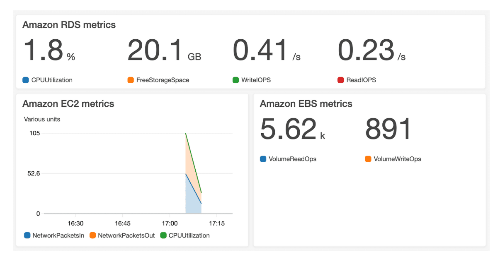

# Monitoring and Analytics

## Amazon CloudWatch

- **Amazon CloudWatch** is a *web service that enables you to monitor and manage various metrics and configure alarm actions based on data from those metrics.*

- CloudWatch uses **metrics** to *represent the data points for your resources*. 
- AWS services send metrics to CloudWatch. CloudWatch then uses these metrics to create graphs automatically that show how performance has changed over time. 
- With CloudWatch, you can *create **alarms** that automatically perform actions if the value of your metric has gone above or below a predefined threshold*.

- The **CloudWatch dashboard** feature enables you to *access all the metrics for your resources from a single location*.

---

## AWS CloudTrail

- **AWS CloudTrail** *records API calls for your account*. *The recorded information includes the identity of the API caller, the time of the API call, the source IP address of the API caller*, and more. 
- You can *think of CloudTrail as a “trail” of breadcrumbs (or a log of actions) that someone has left behind them.*

- With CloudTrail, you can *view a complete history of user activity and API calls for your applications and resources.*

- *Events are typically updated in CloudTrail within 15 minutes after an API call.* 
- You can *filter events by specifying the time and date that an API call occurred, the user who requested the action, the type of resource that was involved in the API call*, and more.

- Within CloudTrail, you can also enable **CloudTrail Insights**. This *optional feature allows CloudTrail to automatically detect unusual API activities in your AWS account*.

---

## AWS Truested Advisor

- **AWS Trusted Advisor** is a *web service that inspects your AWS environment and provides real-time recommendations in accordance with AWS best practices*.

- Trusted Advisor *compares its findings to AWS best practices in five categories*: **Cost Optimization, Performance, Security, Fault Tolerance, and Service Limits**.
- For the checks in each category, Trusted Advisor *offers a list of recommended actions and additional resources to learn more about AWS best practices*.

- When you access the **Trusted Advisor dashboard** on the AWS Management Console, you can *review completed checks for cost optimization, performance, security, fault tolerance, and service limits*. For each category:

1. The **green check** indicates the number of items for which it detected *no problems*.

2. The **orange triangle** represents the number of *recommended investigations*.

3. The **red circle** represents the number of *recommended actions*.

---