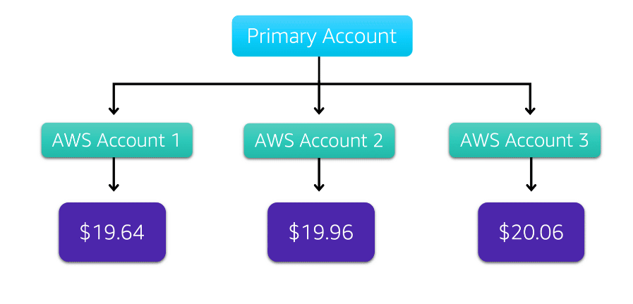

# Pricing and Support

## AWS Free Tier

- The **AWS Free Tier** *enables you to begin using certain services without having to worry about incurring costs for the specified period*. 

- Three types of offers are available: 

1. **Always Free**

- *These offers do not expire and are available to all AWS customers*.

- For example, AWS Lambda allows 1 million free requests and up to 3.2 million seconds of compute time per month. Amazon DynamoDB allows 25 GB of free storage per month.

2. **12 Months Free**

- *These offers are free for 12 months following your initial sign-up date to AWS*.

- Examples include specific amounts of Amazon S3 Standard Storage, thresholds for monthly hours of Amazon EC2 compute time, and amounts of Amazon CloudFront data transfer out.

3. **Trials**

- *Short-term free trial offers start from the date you activate a particular service*. The length of each trial might vary by number of days or the amount of usage in the service.

- For example, Amazon Inspector offers a 90-day free trial. Amazon Lightsail (a service that enables you to run virtual private servers) offers 750 free hours of usage over a 30-day period.

### **For each free tier offer, make sure to review the specific details about exactly which resource types are included!** 

---

## AWS Pricing Concepts

### **How AWS Pricing works**

 AWS offers a range of cloud computing services with pay-as-you-go pricing:

1. **Pay for what you use**:

- *For each service, you pay for exactly the amount of resources that you actually use, without requiring long-term contracts or complex licensing*.

2. **Pay less when you reserve**:

- *Some services offer reservation options that provide a significant discount compared to On-Demand Instance pricing*.

- Say your company is using Amazon EC2 instances for a workload that needs to run continuously. You might choose to run this workload on Amazon EC2 *Instance Savings Plans, as the plan allows you to save up to 72% over the equivalent On-Demand Instance capacity*.

3. **Pay less with volume-based discounts when you use more**:

- *Some services offer tiered pricing, so the per-unit cost is incrementally lower with increased usage*.

- For example, *the more Amazon S3 storage space you use, the less you pay for it per GB*.

### **AWS Pricing Calculator**

- The **AWS Pricing Calculator** lets you *explore AWS services and create an estimate for the cost of your use cases on AWS*. 
- You can *organize your AWS estimates by groups that you define*. 
- *A group can reflect how your company is organized, such as providing estimates by cost center*.

### **AWS Pricing examples**

1. **AWS Lambda**

- For **AWS Lambda**, you are *charged based on the number of requests for your functions and the time that it takes for them to run*.
- AWS Lambda *allows 1 million free requests and up to 3.2 million seconds of compute time per month*.

- You can save on AWS Lambda costs by signing up for a *Compute Savings Plan*. A *Compute Savings Plan offers lower compute costs in exchange for committing to a consistent amount of usage over a 1-year or 3-year term*. This is an example of **paying less when you reserve**.

2. **Amazon EC2**

- With **Amazon EC2**, you *pay for only the compute time that you use while your instances are running*.

- For some workloads, you can significantly reduce Amazon EC2 costs by using **Spot Instances**. For example, suppose that you are running a batch processing job that is able to withstand interruptions. *Using a Spot Instance would provide you with up to 90% cost savings while still meeting the availability requirements of your workload*.

- You can find additional cost savings for Amazon EC2 by considering **Savings Plans and Reserved Instances**.

3. **Amazon S3**

- For Amazon S3 pricing, consider the following cost components:

1. *Storage*
    - You *pay for only the storage that you use*. 
    - You are *charged the rate to store objects in your Amazon S3 buckets based on your objects’ sizes, storage classes, and how long you have stored each object during the month*.

2. *Requests and data retrievals*
    - You *pay for requests made to your Amazon S3 objects and buckets*. 
    - Suppose you are storing photo files in Amazon S3 buckets and hosting them on a website. *Every time a visitor requests the website that includes these photo files, this counts towards requests you must pay for*.

3. *Data Transfer*
    - There is *no cost to transfer data between different Amazon S3 buckets or from Amazon S3 to other services within the same AWS Region*. 
    - However, you *pay for data that you transfer into and out of Amazon S3, with a few exceptions*. 
    - There is *no cost for data transferred into Amazon S3 from the internet or out to Amazon CloudFront*. 
    - There is also *no cost for data transferred out to an Amazon EC2 instance in the same AWS Region as the Amazon S3 bucket*.

4. *Management and replication*
    - You *pay for the storage management features that you have enabled on your account’s Amazon S3 buckets*. 
    - These features include *Amazon S3 inventory, analytics, and object tagging*.

---

## Billing Dashboard

- Use the **AWS Billing & Cost Management dashboard** to *pay your AWS bill, monitor your usage, and analyze and control your costs*.

You can also:

- *Compare your current month-to-date balance with the previous month*, and get a *forecast of the next month based on current usage*.
- *View month-to-date spend by service*.
- *View Free Tier usage by service*.
- *Access **Cost Explorer** and create budgets*.
- *Purchase and manage **Savings Plans***.
- *Publish AWS Cost and Usage Reports*.

---

## Consolidated Billing

- Remember *AWS Organizations*, the service that enables you to manage multiple AWS accounts from a central location? Well, this service provides the option for **Consolidated Billing**.
-The **Consolidated Billing** feature of AWS Organizations *enables you to receive a single bill for all AWS accounts in your organization*. 
- By consolidating, you can *easily track the combined costs of all the linked accounts in your organization*.
- The *default maximum number of accounts allowed for an organization is 4, but you can contact AWS Support to increase your quota*, if needed.
- On your monthly bill, you can *review itemized charges incurred by each account*.

- Another benefit of consolidated billing is the *ability to share bulk discount pricing, Savings Plans, and Reserved Instances across the accounts in your organization*.

---

## AWS Budgets

- In **AWS Budgets**, you can *create budgets to plan your service usage, service costs, and instance reservations*.

- The *information in AWS Budgets updates **three times a day***. This helps you to *accurately determine how close your usage is to your budgeted amounts or to the AWS Free Tier limits*.

- In AWS Budgets, you can also *set custom alerts when your usage exceeds (or is forecasted to exceed) the budgeted amount*.

---

## AWS Cost Explorer

- **AWS Cost Explorer** is a *tool that enables you to visualize, understand, and manage your AWS costs and usage over time*.

- AWS Cost Explorer *includes a default report of the costs and usage for your top five cost-accruing AWS services*.
- *You can apply **custom filters and groups** to analyze your data*. 

- This example of the AWS Cost Explorer dashboard displays monthly costs for Amazon EC2 instances over a 6-month period. The bar for each month separates the costs for different Amazon EC2 instance types (such as t2.micro or m3.large). 

#### **By analyzing your AWS costs over time, you can make informed decisions about future costs and how to plan your budgets.**

---

## AWS Support Plans

- *AWS offers four different **Support plans** to help you troubleshoot issues, lower costs, and efficiently use AWS services*. 

- You can choose from the following Support plans to meet your company’s needs: 

1. **Basic Support**

- **Free for all AWS customers**.
- Includes *access to whitepapers, docs, and support communities*.
- You can also *contact AWS for billing questions and service limit increases*.
- You have access to a *limited selection of AWS Trusted Advisor checks*.
- You can use **AWS Personal Health Dashboard**, a tool that provides alerts and remediation guidance when AWS is experiencing events that may affect you.  

### All of the following Support Plans include all the benefits of Basic Support, in addition to the ability to open an unrestricted number of technical support cases!

- These Support plans have pay-by-the-month pricing and require no long-term constracts.

2. **Developer Support**

- *Lowest costs*.
- Additional features access: **Best practice guidance; Client-side diagnostic tools; Building-block architecture support (guidance for how to use AWS offerings, features, and services together)**.

3. **Business Support**

- *Middle-level costs.*
- Additional features access: **Use-case guidance to identify AWS offerings, features, and services; All AWS Trusted Advisor checks;Limited support for third-party software (common OSs and apps stack components)**.

4. **Enterprise On-Ramp Support**

-*Middle-level costs*.
- Additional features access: **A pool of Technical Account Managers (provide proactive guidance and coordinate access to programs and AWS experts); A Cost Optimization workshop (once a year); A Concierge support team for billing and account assistance; Tools to monitor costs and performance through Trusted Advisor and Health API/Dashboard**. 
- Proactive Support Services (provided by a pool of Technical Account Managers): **Consultative review and architecture guidance (once per year); Infrastructure Event Management support (once per year); Support automation workflows; 30minutes or less response time for business-critical issues**. 

5. **Enterprise Support**

- *Highest costs*.
- Additional features access: **Designated Technical Account Manager (TAM) to provide proactive guidance and coordinate access to programs and AWS experts; A Concierge support team for billing and account assistance; Operations Review and tools to monitor health; Training and Game Days to drive innovation; Tools to monitor costs and performance through Trusted Advisor and Health API/Dashboard.**
- Full access to proactive services provided by a designated TAM: **Consultative review and architecture guidance; Infrastructure Event Management support; Cost Optimization workshops ad tools; Support automation workflows;15 minutes or less response time for business-critical issues.**

### **Technical Account Manager (TAM) 

- The **TAM** is *your primary point of contact at AWS*. 
- If your company subscribes to *Enterprise Support or Enterprise On-Ramp, your TAM educates, empowers, and evolves your cloud journey across the full range of AWS services*. 
- TAMs *provide expert engineering guidance, help you design solutions that efficiently integrate AWS services, assist with cost-effective and resilient architectures, and provide direct access to AWS programs and a broad community of experts*.

---

## AWS Marketplace

- **AWS Marketplace** is a *digital catalog that includes thousands of software listings from independent software vendors*.
- You can use AWS Marketplace to *find, test, and buy software that runs on AWS*. 

- *For each listing in AWS Marketplace, you can access detailed information on **pricing options, available support, and reviews** from other AWS customers*.

- You can also *explore software solutions by industry and use case*.

### *AWS Marketplace categories*

- Within each category, you can *narrow your search by browsing through product listings in subcategories*. 
- For example, subcategories in the DevOps category include areas such as Application Development, Monitoring, and Testing.

---
