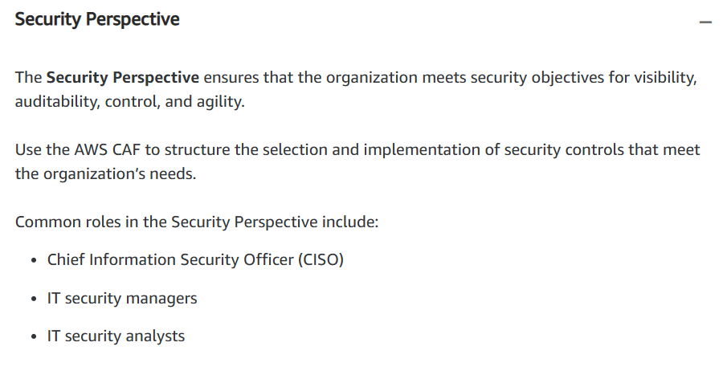

# Migration and Innovation

## AWS Cloud Adoption Framework (AWS CAF) Action Plan

- At the highest level, the **AWS Cloud Adoption Framework (AWS CAF)** *organizes guidance into six areas of focus, called **Perspectives***. 
- *Each **Perspective** addresses **distinct responsibilities***. 
- The planning process *helps the right people across the organization prepare for the changes ahead*.

- In general, the **Business, People, and Governance** *Perspectives* focus on *business capabilities*, whereas the **Platform, Security, and Operations** *Perspectives* focus on **technical capabilities**.

1. **Business Perspective**

2. **People Perspective**

3. **Governance Perspective**

4. **Platform Perspective**

5. **Security Perspective**

6. **Operations Perspective**

---

## Migration Strategies

### ***The 6 R`s of Migration***

1. **Rehosting (Lift-and-Shift)**

- Involves *moving applications without changes*.
- In the scenario of a large scale legacy migration, in which the company is looking to implement its migration and scale quickly to meet a business case, the majority of applications are rehosted. 

2. **Replatforming (Lift, Tinker and Shift)**

- Involves *making a few cloud optimizations to realize a tangible benefit*.
- *Optimization is achieved without changing the core architecture of the application*.

3. **Refactoring (Re-architecting)**

- Involves *reimagining how an application is architectured by using cloud-native features*.
- Driven by a strong business need to add features, scale, or performance that would otherwise be difficult to achieve in the application`s existing environment.

4. **Repurchasing**

- Involves *moving from a traditional license to a software-as-a-service model*. 
- For example, a business might choose to implement the repurchasing strategy by migrating from a Customer Relationship Management system (CRM) to Salesforce.com. 

5. **Retain**

- Consists of *keeping applications that are critical for the business in the source environment.*
- This might include applications that require major refactoring before they can be migrated, or, work that can be postponed until a later time. 

6. **Retire**

- The process of *removing applications that are nolonger needed*. 

---

## AWS Snow Family

- The **AWS Snow Family** is a *collection of physical devices that help to physically transport up to exabytes of data into and out of AWS*. 

- *AWS Snow Family* is composed of **AWS Snowcone, AWS Snowball, and AWS Snowmobile**. 

- These devices *offer different capacity points, and most include built-in computing capabilities*. 
- *AWS owns and manages the Snow Family devices and integrates with AWS security, monitoring, storage management, and computing capabilities*.

1. ***AWS Snowcone***

- **AWS Snowcone** is a *small, rugged, and secure edge computing and data transfer device*. 
- It features *2 CPUs, 4 GB of memory, and 8 TB of usable storage*.

2. ***AWS Snowball***

- Offers 2 types of devices:

a. **Snowball Edge Stowage Optimized devices**

- Well suited for *large-scale data migrations and recurring transfer workflows, in addition to local computing with higher capacity needs*.
- **Storage**: *80 TB of Hard disk drive (HDD) capacity for block volumes and Amazon S3 compatible object storage; 1 TB of SATA solid state drive (SSD) for block volumes*.
- **Compute**: *40 vCPUs and 80 GiB of memory to support Amazon EC2 sbe1 instances (equivalent to C5)*.

b. **Snowball Edge Compute Optimized devices**

- Provides *powerful computing resources for use cases such as machine learning, full motion video analysis, analytics, and local computing stacks*.
- **Storage**: *42 TB usable HDD capacity for Amazon S3 compatible object storage or Amazon EBS compatible block volumes and 7.68 TB of usable NVMe SSD capacity for Amazon EBS compatible block volumes*.
- **Compute**: 52 vCPUs, 208 GiB of memory, and an optional NVIDIA Tesla V100 GPU. Devices run Amazon EC2 sbe-c and sbe-g instances, which are equivalent to C5, M5a, G3, and P3 instances.

3. ***AWS Snowmobile***

- It is *an exabyte-scale data transfer service used to move large amounts of data to AWS*.
- You can *transfer up to 100 petabytes of data per Snowmobile, a 45-foot long ruggedized shipping container, pulled by a semi trailer truck, accompanied by a security team during transit*.

---

## Innovation with AWS

- When examining *how to use AWS services*, it is important to *focus on the desired outcomes*. 
- You are properly equipped to drive innovation in the cloud if you can clearly articulate the following conditions: 

a. The current state

b. The desired state

c. The problems you are trying to solve

- Consider some of the paths you might explore in the future as you continue on your cloud journey:

1. **Serveless Applications**

- **Serverless** = apps that don`t require you to provision, maintain, or administer servers.
- You do not need to worry about fault tolerance or availability, as AWS handles these capabilities for you. 
- *AWS Lambda* is an example of a service that you can use to run serverless apps. If you design your architecture to trigger Lambda functions to run your code, you can bypass the need to manage a fleet of servers. 

2. **Artificial Intelligence**

- AWS offers a variety of services powered by AI:

a. *Amazon Transcribe* = convert speech to text.

b. *Amazon Comprehend* = discover patterns in text.

c. *Amazon Fraud Detector* = identify potentially fraudulent online activities. 

d. *Amazon Lex* = build voice and text chatbots. 

3. **Machine Learning**

- Traditional *machine learning (ML) development is complex, expensive, time consuming, and error prone*. 
- AWS offers **Amazon SageMaker** to *remove the difficult work from the process and empower you to build, train, and deploy ML models quickly*.
- You can *use **ML** to analyze data, solve complex problems, and predict outcomes before they happen*.

---

